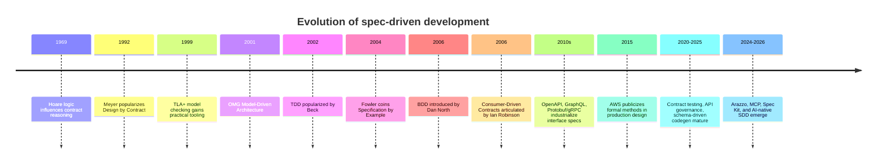
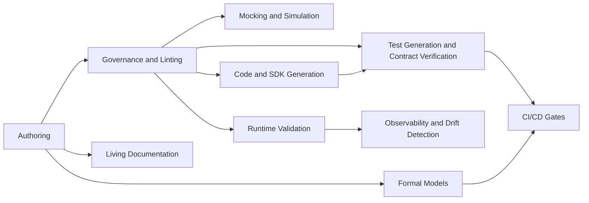

# Spec Driven Development

## Executive Summary

Spec Driven Development, or SDD, is best understood as an umbrella family of practices in which a **machine-readable or at least operationally testable specification becomes the primary coordination artifact** for design, implementation, verification, release, and often runtime governance. In older lineages, that “spec” may be a formal contract, executable acceptance criteria, a model, or an interface definition. In newer AI-native usage, major vendors and open-source projects now use “spec-driven development” more explicitly to mean putting structured specs at the center of AI-assisted software delivery so that requirements, design, code generation, and validation stay aligned. The term is therefore not a single standardized methodology; it is a converging pattern across API-first, contract-driven, model-driven, specification-by-example, and formal-methods communities. citeturn23search1turn23search11turn9search0turn37search1turn6search4

The strongest current commercial momentum is in **API-first and contract-centered SDD**, where specifications such as OpenAPI, AsyncAPI, Smithy, Protobuf, GraphQL SDL, and JSON Schema drive documentation, SDK generation, mocks, tests, governance rules, and compatibility checks. Postman’s 2025 report says **82% of organizations have adopted some level of API-first**, up from **74% in 2024**, and reports that fully API-first organizations are more likely to generate substantial revenue from APIs. At the same time, collaboration remains a major bottleneck: Postman reports **93% of teams struggle with API collaboration** in 2025. These findings matter because they show both adoption and the practical reason specs matter: they reduce ambiguity across distributed teams and now across machine consumers such as AI agents. citeturn3view0turn4view0turn5view0

The strongest technical case for SDD is not merely “better documentation.” It is that specs can serve as a **shared source of truth** that supports parallel development, earlier fault detection, safer change management, automated regression, and explicit governance. Evidence is strongest in several subdomains rather than for “SDD” as a unified label: API-first surveys show better perceived productivity and fewer failures; consumer-driven contract testing research shows value for syntactic interoperability and shift-left integration testing; executable acceptance tests improve requirements–verification alignment and give teams a safety net for frequent releases; model-driven engineering and contract-based design show repeated benefits in robustness and maintainability, especially in complex or safety-critical systems, albeit with persistent adoption barriers. citeturn5view2turn13search9turn18search9turn35view0turn32view0turn19view1turn20view0

The main risks are equally clear. Specs can become stale, incomplete, too abstract, or misleadingly precise. Teams often overestimate what generated code or contract checks guarantee. Example-based specs can miss unenumerated behaviors; formal methods can impose steep learning curves and tooling friction; model-driven approaches often fail for organizational rather than purely technical reasons; and API contracts still need security, authorization, and policy enforcement layers that ordinary interface specs do not capture well. OWASP’s API Security Top 10, NIST SSDF, the EU Cyber Resilience Act, and FDA device-cybersecurity guidance all reinforce that “having a spec” is not enough unless it is linked to secure development, traceability, and enforcement. citeturn19view1turn32view0turn17search0turn16search1turn16search0turn16search2

The most important emerging direction is **AI-assisted spec production and spec consumption**. New work from 2025 shows LLM pipelines generating OpenAPI specifications from unstructured documentation at enterprise scale, saving thousands of hours; ICSE 2025 highlights that code generation quality often fails because LLMs misunderstand specifications; FSE 2025 shows small language models can perform competitively in OpenAPI-based REST testing; and the recent rise of GitHub Spec Kit and Microsoft’s AI-native SDD framing pushes the field toward more explicit, reviewable, and evolvable specifications as the control plane for AI coding. The frontier is shifting from “generate code from prompts” to “generate, validate, and execute against structured specifications.” citeturn38view0turn38view3turn11search6turn23search0turn23search1turn23search11

My bottom-line assessment is that SDD is already mainstream in **interface-centric systems** and increasingly important in **AI-assisted engineering**, but it is still uneven in **implementation-centric application code**. The most pragmatic strategy today is not to adopt a grand unified SDD doctrine. It is to build a layered pipeline: specification authoring, linting, generated artifacts, contract verification, property-based testing, policy enforcement, and selective formal verification for high-risk workflows. That is where the best evidence and tooling maturity currently exist. citeturn6search12turn12search7turn13search1turn15search4turn21view0

## Definitions, Scope, and Variants

In its broadest and most defensible sense, SDD means that **specifications precede or co-evolve with implementation and remain first-class artifacts throughout delivery**. That definition comfortably includes Design by Contract, model-driven engineering, contract-driven API development, specification by example, BDD, and spec-first AI workflows. Modern vendor usage narrows this to structured, versioned artifacts that both humans and tools can consume. Microsoft’s 2026 framing is explicit: SDD “makes structured specs the shared source of truth for both humans and AI,” while GitHub Spec Kit defines SDD as putting specifications at the center of AI-assisted development rather than “jumping straight to code.” citeturn23search1turn23search11

Older lineages contribute distinct intellectual roots. Design by Contract formalized component obligations through preconditions, postconditions, and invariants, with Meyer’s 1992 article and Eiffel ecosystem giving the canonical formulation. Model-Driven Architecture and later model-driven engineering emphasized models as primary artifacts from which code and other artifacts can be transformed. Specification by Example, later closely associated with executable specifications and BDD, reframed requirements as concrete examples understandable to business and technical stakeholders alike. Consumer-Driven Contracts then specialized the idea for service evolution, while API description standards turned interface specifications into industrial, language-neutral machine-readable assets. citeturn9search0turn9search4turn10search1turn32view0turn37search1turn8search3turn37search0turn6search4

The most useful way to reason about SDD is therefore not as a binary state but as a spectrum of “what is specified,” “how executable the spec is,” and “where in the lifecycle the spec has force.” Some specs are mostly descriptive; others generate code or tests; others block releases; a smaller set can be formally verified or enforced at runtime. citeturn6search4turn13search9turn15search4turn9search14

### Variant taxonomy

| Variant | Primary artifact | Typical authors | What it drives | Limits |
|---|---|---|---|---|
| Design by Contract | Preconditions, postconditions, invariants | Developers, library authors | Runtime checks, static reasoning, correctness contracts | Narrower than end-to-end business behavior; not widely supported natively in mainstream languages. citeturn9search0turn9search4turn20view0 |
| API-first / spec-first | OpenAPI, AsyncAPI, Smithy, Protobuf, GraphQL SDL, JSON Schema | API designers, platform teams, app teams | Docs, mocks, SDKs, compatibility checks, tests, gateways | Often captures interface shape better than business semantics or authorization policy. citeturn6search4turn6search1turn6search2turn26search0turn26search6turn26search22 |
| Consumer-driven contract testing | Consumer expectations plus provider verification results | Service consumers and providers | Shift-left integration safety, compatibility across independent deployments | Strong on interoperability; weaker on full system semantics and nonfunctional properties. citeturn13search9turn6search3turn14search2turn18search9 |
| Model-driven engineering | UML, SysML, domain models, transformations | Architects, systems engineers, domain experts | Code generation, architecture analysis, traceability, documentation | Tooling, skills, and organizational friction often dominate. citeturn10search1turn10search4turn32view0turn19view1 |
| Specification by Example / BDD | Examples, Gherkin scenarios, executable acceptance criteria | Product, QA, dev, analysts | Shared understanding, acceptance tests, living documentation | Example coverage is inherently partial; maintenance can become expensive. citeturn7search0turn7search1turn8search1turn35view0 |
| TDD overlap | Unit tests as executable design probes | Developers | Design feedback, regression safety, refactoring confidence | Usually specifies code behavior locally, not cross-team contracts or system workflows. citeturn8search23turn8search2 |
| Formal methods / verification-aware SDD | TLA+, Alloy, Dafny, contract formalisms | Specialized engineers, high-assurance teams | Model checking, proofs, design debugging, high-assurance implementation | Steep skills curve, state-space limits, selective applicability. citeturn15search1turn15search6turn9search14turn21view0 |

Two overlaps are especially important in practice. First, **BDD and specification by example** are usually best seen as human-centered SDD: the spec is business-readable and optionally executable. Second, **API-first and contract-driven** are machine-centered SDD: the spec is structured enough to drive code generation and automated verification. Modern “AI-native SDD” tries to combine both by using structured but reviewable specs as the control artifact for LLMs. citeturn7search0turn37search1turn6search4turn23search1turn23search11

## Trend Evolution

The long arc of SDD runs from formal reasoning to industrial API ecosystems to AI-native workflows. The most recent five years show a sharp rise in **specification formats that are useful not only for humans and CI systems, but also for LLMs and software agents**. Postman’s 2025 report explicitly frames API strategy as AI strategy and notes that APIs are now “powering agents,” while awareness of the Model Context Protocol is high but routine usage remains early. At the same time, the OpenAPI Initiative’s Arazzo specification extends interface descriptions into deterministic API workflows, which is a meaningful step toward executable multi-call system semantics. citeturn3view0turn23search2turn30search0

Three trend lines stand out.

The first is the **industrialization of interface specifications**. OpenAPI is now broadly positioned as the most widely used standard for describing HTTP APIs, while AsyncAPI performs a similar role for event-driven systems, Smithy powers AWS APIs and SDKs, gRPC uses Protobuf as both IDL and message format, and GraphQL centers development on a typed schema. These standards make specs stable enough to support vendor-neutral tooling ecosystems rather than one-off generation scripts. citeturn6search0turn6search12turn6search1turn6search2turn26search1turn26search6

The second is the **movement from descriptive specs to executable workflow specs**. Contract testing turned interface descriptions into deployment gates; property-based schema testing turned them into test generators; policy-as-code turned declarative rules into enforcement decisions; and Arazzo now adds structured multi-operation workflows on top of API descriptions. This is a substantive change: the spec is no longer just a document about the system, but an active artifact in build, release, and operation. citeturn13search9turn13search1turn15search4turn30search0

The third is **AI-assisted specification work**. GitHub Spec Kit and Microsoft’s spec-first AI-native engineering push are direct evidence that large vendors now see structured specifications as a way to constrain and align LLM coding. Academic work from 2025 reinforces the same story from another angle: LLMs often fail because they misunderstand specifications, so better code generation increasingly depends on better specification understanding; meanwhile, new pipelines generate OpenAPI specifications from unstructured docs, or generate formal program specifications from code and problem statements. citeturn23search0turn23search1turn23search11turn38view3turn38view0turn11search5

Recent adoption data also supports the sense that specification-centric development is becoming routine. Postman reports that **API-first adoption rose from 66% in 2023 to 74% in 2024 and 82% in 2025**, and that API-first organizations report faster production, fewer failures, and faster recovery. This is not proof that all SDD variants are booming equally, but it is strong evidence that **spec-first work is becoming standard operating procedure** in a major slice of modern software delivery. citeturn5view0turn4view0turn3view0

## Tooling and Ecosystem

The SDD tooling landscape is now dense enough to think of it as an ecosystem rather than a set of isolated tools. The most mature center of gravity is API and service development, where the same specification may feed editors, linters, docs, mocks, client generators, contract verifiers, release checks, and runtime validators. Adjacent ecosystems then add acceptance-level specs, formal models, or policy layers. citeturn6search12turn12search7turn13search9turn15search4

### Representative tools and platforms

*Maturity below is an analytical judgment based on longevity, ecosystem breadth, and deployment readiness, with the cited source column pointing to the underlying project or vendor documentation.*

| Category | Tool / platform | Core function | Language / spec support | License / model | CI/CD / runtime notes | Maturity | Official docs |
|---|---|---|---|---|---|---|---|
| API description standard | OpenAPI | HTTP API description, docs, tests, codegen ecosystem | Language-agnostic HTTP APIs | Open standard, Linux Foundation ecosystem | Drives codegen, linting, docs, tests, governance | Very high | citeturn6search4turn6search12turn30search9 |
| Event API standard | AsyncAPI | Event-driven API description | Protocol-agnostic event APIs | Open source initiative; Apache-licensed tooling | Validation, docs, generation via CLI / generator | High | citeturn6search1turn6search17turn25search17turn27search15 |
| Protocol-agnostic IDL | Smithy | Service and SDK modeling | One model, 10+ language targets | Apache-2.0 | Generates clients, servers, docs; validates models | High | citeturn6search2turn6search18turn25search10 |
| RPC schema / IDL | Protobuf + gRPC | Structured data and RPC service definitions | Many languages; gRPC plugins generate client/server code | Open source | Strong codegen-first workflow; common in platform teams | Very high | citeturn26search0turn26search1turn26search16turn26search23 |
| Typed API schema | GraphQL | Schema and query contract for APIs | Strongly typed schema; many server/client stacks | Open standard / ecosystem | Works well with docs, codegen, schema checks | High | citeturn26search6turn26search2turn26search17 |
| Schema validation | JSON Schema | Declarative validation and annotation for JSON | JSON-based systems and APIs | Open standard | Common runtime validation layer; underpins many tools | Very high | citeturn26search22turn15search7turn26search3 |
| Workflow spec | Arazzo | Deterministic API workflows across calls/APIs | Works with OpenAPI / AsyncAPI descriptions | Open specification | Emerging for workflow testing and agent execution | Emerging | citeturn30search0turn30search10 |
| Contract testing | Pact + Pact Broker / PactFlow | Consumer/provider compatibility verification | 12+ languages in PactFlow marketing; OSS Pact ecosystem | OSS + commercial managed platform | `can-i-deploy` release gating, broker-based verification | High | citeturn13search9turn6search3turn14search5turn6search15 |
| Contract testing | Spring Cloud Contract | Consumer-driven contract tests and stubs | JVM-native, polyglot support via stubs | Apache-2.0 | Generates tests and WireMock stubs; supports artifact repos | High | citeturn12search0turn14search3turn14search15turn24search2 |
| Contract-driven development | Specmatic | Turns API specs into executable contracts, tests, mocks | OpenAPI, AsyncAPI, GraphQL, Protobuf, WSDL | Open source + commercial offerings | Built for contract-driven delivery pipelines | Medium-high | citeturn13search0turn13search4turn13search13 |
| Schema-driven testing | Schemathesis | Property-based testing from API schemas | OpenAPI, GraphQL | MIT | CLI/Python integration; fuzzes edge cases from schema | High | citeturn13search1turn13search5turn25search7 |
| Governance / linting | Spectral | Linter/rules engine for API descriptions | OpenAPI, AsyncAPI, JSON/YAML, Arazzo | Open source | Ideal pre-merge / CI policy gate | High | citeturn12search7turn12search3turn12search15 |
| Governance / docs | Redocly CLI + Redoc | Linting, validation, docs publishing | OpenAPI; CLI also supports AsyncAPI and Arazzo | OSS CLI / commercial platform | Common docs-as-code and governance workflow | High | citeturn12search10turn27search6turn27search14 |
| API platform | Postman Spec Hub + CLI | Multi-spec authoring, governance, testing | OpenAPI, AsyncAPI, Protobuf, GraphQL, Smithy | Commercial SaaS + free tiers | CLI runs tests and governance rules in pipelines | High | citeturn28search7turn28search3turn14search4turn14search16 |
| API platform | Stoplight | Design-first authoring, docs, mock servers | OpenAPI-focused platform | Commercial SaaS | Good for collaborative design and hosted artifacts | High | citeturn28search2turn28search6 |
| Code generation | OpenAPI Generator | SDKs, server stubs, docs from OpenAPI | 50+ client generators | Open source | Easy to automate in build pipelines | Very high | citeturn27search0turn27search16 |
| Code generation | Swagger Codegen | SDK, stub, doc generation | OpenAPI | Open source | Mature legacy ecosystem; still widely referenced | High | citeturn27search1turn27search17turn27search25 |
| Commercial SDK generation | APIMatic | SDKs, docs, code samples | 8+ mainstream languages; multiple input formats | Commercial | Often used for consumption-layer automation | Medium-high | citeturn28search1turn28search5turn28search17 |
| Commercial SDK generation / testing | Speakeasy | SDK generation, docs, contract/SDK testing | OpenAPI-driven; multiple SDK languages | Commercial | GitHub Actions support; Arazzo-backed custom tests | Medium-high | citeturn29search1turn29search0turn29search7turn29search20 |
| Acceptance specs | Cucumber | Plain-language automated acceptance tests | Multi-language ecosystem | MIT-licensed docs and major implementations | Living docs / BDD workflow | Very high | citeturn7search0turn24search0turn24search4 |
| Formal / verification-aware | Dafny | Verification-aware programming language | Dafny language with spec constructs | Open source | Static verifier with contracts, frames, termination | High in niche | citeturn9search14turn9search2 |
| Formal / model checking | TLA+ with TLC / Apalache | High-level system specs and verification | Distributed/concurrent system design | Open ecosystem / community tools | Best for design-time validation, not ordinary CRUD apps | High in niche | citeturn15search1turn15search9turn15search6 |
| Policy enforcement | Open Policy Agent | Policy-as-code decisions | Rego over structured data | Open source | Enforces policies in microservices, Kubernetes, CI/CD, gateways | High | citeturn15search4turn15search16 |

Several patterns emerge from this table.

First, **the most mature tools sit around interface specifications**. That is where formats are standardized, language-neutral, and cheap to automate. As a result, API-first SDD has a much more coherent toolchain than, say, business-rule specs for ordinary internal application logic. citeturn6search12turn6search1turn6search2turn27search16

Second, **CI/CD integration is no longer optional** in serious SDD practice. Pact’s `can-i-deploy`, Spring Cloud Contract’s stub publication, Postman CLI governance/test runs, Speakeasy’s GitHub Actions testing, and Swagger Contract Testing’s GitHub workshop flow all show the same pattern: a spec becomes valuable when it can block an unsafe merge or deployment. citeturn6search3turn14search3turn14search8turn29search7turn14search1

Third, **testing now spans three complementary layers**. Example-based acceptance tests cover stakeholder-visible behavior; contract verification covers interface compatibility; and property-based schema testing explores edge cases the examples missed. Teams that treat these as substitutes rather than complements usually get brittle suites or false confidence. citeturn7search0turn13search9turn13search1turn35view0

Fourth, **runtime enforcement is its own layer**. JSON Schema validators and OpenAPI validators can enforce payload structure, and OPA can enforce policy decisions in services, gateways, and pipelines, but neither of these replaces deep behavioral or security testing. In practice, robust SDD stacks use runtime validators to catch drift and misuse, while relying on CI automation for broader compatibility and correctness checks. citeturn26search22turn15search4turn15search16

## Empirical Evidence, Adoption, and ROI

The empirical literature is uneven. Evidence is strongest where SDD appears under more specific labels such as **API-first**, **consumer-driven contract testing**, **test-cases-as-requirements**, and **model-driven engineering**. There is still relatively little high-quality empirical work that evaluates “Spec Driven Development” as a unified umbrella concept. That gap matters, because some evangelism now outruns the evidence. citeturn19view1turn20view0turn35view0

### Survey and case-study signals

The clearest recent quantitative signals come from large API surveys. In 2024, Postman reported that **74%** of respondents were API-first, up from **66%** in 2023; **63%** could produce an API within a week, up from **47%** the year prior; and API-first organizations recovered from failures faster, often within an hour. In 2025, Postman reported **82%** had adopted some level of API-first, with **25% fully API-first**, and found that fully API-first organizations were much more likely to generate a large share of revenue from APIs. Those are survey findings rather than controlled causal results, but they are still among the strongest broad adoption indicators available. citeturn4view0turn3view0turn5view2

The 2023 Postman report strengthens the pattern. It describes API-first leaders as producing APIs faster, encountering fewer failures, restoring service faster, and being more represented in large organizations and financial services. More than **75%** of respondents somewhat or strongly agreed that developers at API-first companies are more productive, create better software, and integrate faster with partners. Again, these are self-reported perceptions, but they are consistent across several editions of the survey. citeturn5view0turn5view2

On adoption by industry, APIs remain strongest in technology and software-heavy sectors, but financial services stands out repeatedly. Postman’s 2023 report found financial services had the highest share of self-identified API-first leaders, and the 2025 report says financial services firms are out-investing all other measured sectors in API-driven business models. That aligns with the practical reality that highly regulated, integration-heavy sectors benefit from explicit interface contracts. citeturn5view0turn3view0

### Executable requirements and acceptance-level specs

A recent multi-case study of “test cases as requirements” is highly relevant to human-centered SDD. Across three companies, researchers identified multiple variants, from fully behavior-driven to stand-alone strict machine-executable specifications. In one company, interviewees reported that executable specifications aligned business requirements with verification, supported efficient regression testing, enabled requirements coverage tracking, and gave teams enough confidence to release weekly; one interviewee described the approach as helping projects “deliver on time and almost on budget.” The same study also documented the downside: poor structure makes change impact analysis costly, examples can be rigid, and quality requirements are harder to express and automate than pure functional behavior. citeturn35view0

This is a good illustration of where SDD works best: when a specification becomes both a communication artifact and a regression safety net. It also highlights a recurrent truth across the field: **maintaining executable specs is work**, and the maintenance burden rises when the spec format is too low-level or over-coupled to implementation details. citeturn35view0

### Consumer-driven contract testing

For microservices, the evidence base is smaller but growing. Pact’s own documentation defines contract testing as checking an integration point in isolation against a shared contract; a 2025 STVR study argues consumer-driven contract testing helps ensure **syntactic interoperability** and complements a broader testing strategy; and a 2022 empirical analysis of microservice repositories found only a subset of projects were actually using consumer-driven contract testing, focusing closely on four such projects. Taken together, these sources suggest contract testing is valuable but still not universal in open-source microservices practice. citeturn13search9turn18search9turn33search2

Industry tooling vendors reinforce the qualitative case. SmartBear markets contract testing as reducing end-to-end testing effort and catching bugs sooner; PactFlow emphasizes earlier fault detection and faster movement; and Spring Cloud Contract’s reference material shows how contract artifacts and stubs can be packaged and published through build pipelines. These are vendor claims, so they should not be treated as neutral proof, but they are directionally consistent with the limited independent studies. citeturn14search17turn14search2turn14search3

### Model-driven engineering and contract-based design

The MDE literature provides a longer-run view of adoption patterns. A 2014 industry study found that MDE can provide genuine benefits in appropriate contexts, but that success or failure depends more on organizational and managerial factors than purely technical ones. A 2025 interview-based PLOS One study similarly found practitioners emphasized robustness, reliability, speed, and organization benefits, while also reporting steep learning curves, technological constraints, organizational resistance, and skill shortages. The key lesson is that “having a better specification formalism” is rarely enough; organizational fit and workflow integration dominate adoption outcomes. citeturn32view0turn19view1

A 2025 systematic mapping study on contract-based design for dependable systems is also revealing. It reviewed **1,221** initially identified papers, analyzed **288** primary studies in detail, and concluded that although contract-based design has a strong theoretical foundation, it has **not yet been widely adopted in industry**, especially outside specialized dependable-system contexts. That makes contract-based design important as a research and high-assurance practice, but not yet a broadly mainstream default for ordinary product teams. citeturn20view0

### ROI, quality, velocity, and reliability

Hard ROI metrics remain sparse. The most defensible metrics today are proxy indicators: perceived productivity, lead time to a shipped API, lower failure rates, faster recovery, reduced integration friction, and success in parallel development. Postman’s surveys provide the clearest broad metrics for velocity and reliability; executable-spec case studies provide stronger mechanism-level evidence for regression safety and alignment; and MDE / formal methods studies provide evidence of robustness and maintainability in suitable contexts. What is missing are more controlled cross-company comparisons that isolate the effect of specification-centric methods from organizational maturity, platform investment, and team skill. citeturn3view0turn4view0turn35view0turn32view0turn19view1

## Security, Compliance, and Organizational Risks

One of the strongest reasons SDD is gaining renewed relevance is that regulators and security frameworks increasingly reward **traceable, reviewable, testable development artifacts**. NIST’s Secure Software Development Framework explicitly asks organizations to integrate secure practices into whatever SDLC they use, rather than treating security as separate. The EU Cyber Resilience Act establishes cybersecurity requirements for products with digital elements in the EU, and the FDA’s device-cybersecurity guidance emphasizes design, labeling, and documentation in premarket submissions. Specification-centered workflows can help produce the traceability and evidence these frameworks demand, especially when backed by policy checks and auditable CI. citeturn16search1turn16search5turn16search0turn16search2

For APIs specifically, security is not automatically solved by an interface contract. OWASP’s API Security Top 10 for 2023 still highlights problems such as broken object level authorization, broken authentication, and inadequate inventory management. In fact, formal interface descriptions can create a false sense of safety if teams confuse “the payload validates” with “the operation is authorized, rate-limited, observable, and resilient.” This is why a serious SDD program usually needs at least three layers: interface spec validation, security/policy enforcement, and operational monitoring. citeturn17search0turn17search3turn15search4

Policy-as-code is increasingly important here. OPA explicitly targets policy enforcement across microservices, Kubernetes, gateways, and CI/CD pipelines, making it a natural complement to spec-first delivery. In practical terms, OpenAPI or AsyncAPI tells you what the interface should look like; OPA or similar policy layers tell you whether the interaction should be allowed under organizational, compliance, or risk rules. citeturn15search4turn15search16

The biggest organizational risks are more mundane than the technical ones. Across the MDE and executable-spec literature, the recurring failure modes are stale artifacts, poor tool usability, fragmented ownership, low stakeholder participation, over-rigid examples, and specs that fail to integrate with day-to-day work. Postman’s surveys add a contemporary version of the same problem: code-only collaboration breaks down in distributed teams, and API changes run into broken communication. A specification only helps if it is where the work actually happens. citeturn19view1turn32view0turn4view0turn3view0

## Recommendations and Open Questions

For practitioners, the best current playbook is layered rather than ideological.

- Start with **one specification surface that already has strong tooling**. For most organizations, that is the API and event boundary: OpenAPI, AsyncAPI, Smithy, Protobuf/gRPC, GraphQL SDL, or JSON Schema. That is where generation, testing, and governance ROI is highest today. citeturn6search4turn6search1turn6search2turn26search1turn26search6turn26search22
- Treat specs as **versioned code artifacts**, not as slideware. Put them in source control, lint them in CI, review them like code, and generate downstream artifacts from them wherever practical. citeturn12search7turn12search10turn14search8
- Use **multiple complementary verification layers**: executable examples for stakeholder meaning, contract verification for compatibility, property-based schema testing for edge cases, and policy-as-code for security/compliance gates. citeturn7search0turn13search9turn13search1turn15search4
- Avoid “spec theater.” A spec that does not gate builds, generate something useful, or drive runtime checks will usually decay. Tie it to at least one valuable automation loop in the first quarter of adoption. citeturn14search0turn6search3turn14search3
- For high-risk distributed or safety-critical workflows, add **selective formal methods**, not blanket formalization. AWS’s public experience shows formal specification and model checking are especially useful at design time for critical distributed systems, and modern tools like Dafny and Apalache continue to lower the barrier in bounded domains. citeturn21view0turn15search6turn9search14
- For AI-assisted development, require the agent to work from a structured spec, and validate agent output against that spec. This is where current vendor direction and recent research most strongly converge. citeturn23search1turn23search11turn38view3turn38view0

### Open questions and limitations

The main research limitation is that “Spec Driven Development” is newer as a label than as a practice. Much of the strongest evidence comes from **adjacent named traditions** rather than directly labeled SDD. That means some conclusions here are necessarily integrative: they synthesize evidence from API-first surveys, contract-testing studies, executable-spec case studies, MDE adoption work, and formal-methods reports, rather than relying on a single unified SDD literature base. citeturn23search1turn19view1turn32view0turn35view0

Open research questions include how to measure causal ROI across SDD variants; how to prevent spec drift in AI-assisted development; how best to connect human-readable examples with machine-checked formal models; how to express cross-service workflows and security policies together; and how to make formal or contract-based techniques usable by generalist product teams without requiring specialist training. citeturn20view0turn38view3turn30search0turn19view1

## Annotated Bibliography

**Meyer, “Applying Design by Contract” (1992).** This is still the canonical industrial articulation of software contracts as explicit preconditions, postconditions, and invariants. It is the clearest seminal source for the notion that correctness can be designed into component interfaces rather than only tested afterward. citeturn9search0

**Hutchinson, Whittle, and Rouncefield, “Model-driven engineering practices in industry” (2014).** One of the most useful empirical studies for the broader SDD family. Its lasting contribution is not simply that MDE can work, but that organizational fit, progressive rollout, and business alignment matter more than tool enthusiasm alone. citeturn32view0

**Alfraihi and Lano, “Report from MDE practice” (2025).** A newer empirical counterpoint showing that practitioners still see robustness, reliability, and speed benefits from model-driven work, but continue to struggle with tool complexity, integration, and skills. It is valuable because it updates the human factors story rather than repeating only older adoption debates. citeturn19view1

**Okumus, Ramic, and Kugele, “A Systematic Mapping Study on Contract-based Software Design for Dependable Systems” (2025).** Important because it consolidates the contract-based design literature at scale and explicitly concludes that industrial adoption remains limited despite deep theory. It is one of the best recent sources for identifying research gaps between formal promise and practical uptake. citeturn20view0

**Fowler, “Specification By Example” (2004).** A short but influential source linking examples to shared understanding and grounding abstraction in real scenarios. It is one of the clearest semantic bridges between human-readable requirements and executable specification practices. citeturn37search1

**Dan North, “Introducing BDD” (2006).** The seminal BDD statement. It is crucial for understanding how TDD evolved into a broader behavior/specification conversation involving analysis, examples, and acceptance automation rather than only developer tests. citeturn8search3

**Robinson, “Consumer-Driven Contracts: A Service Evolution Pattern” (2006).** The original conceptual framing for consumer-driven service contracts. It remains useful because it emphasizes service evolution and compatibility, not just testing technique. citeturn37search0

**Bjarnason et al., “A Multi-Case Study of Agile Requirements Engineering and Test Alignment” (2023 version of a multi-case study).** Particularly valuable for practitioners because it shows how acceptance tests can serve as executable requirements in real companies, with direct consequences for release confidence, regression safety, and customer alignment. It also honestly documents the maintenance and communication challenges. citeturn35view0

**Postman State of the API Reports (2023–2025).** These are not academic causal studies, but they are currently the richest recurring large-sample industry barometer for API-first and spec-centric practice. Their main value is trend detection: rising API-first adoption, strong collaboration pain, and the growing role of APIs as both business products and AI/agent interfaces. citeturn5view0turn4view0turn3view0

**Newcombe et al., “How AWS uses formal methods” (2015).** Still one of the most important industrial formal-methods testimonies, showing where high-level specifications and model checking can pay off in large distributed systems. Its relevance persists because it grounds formal specification in operational engineering rather than academic idealization. citeturn21view0

**Lazar et al., “Generating OpenAPI Specifications from Online API Documentation with Large Language Models” (ACL 2025).** A key paper for the AI-assisted future of SDD. It shows that LLM-plus-rules pipelines can recover machine-readable specifications from messy documentation at enterprise scale and save substantial manual effort. citeturn38view0

**ICSE 2025, “Fixing Large Language Models’ Specification Misunderstanding for Better Code Generation.”** This is an important signal that the next bottleneck in AI coding is not only code synthesis but specification understanding. It supports the broader argument that better structured specs are becoming foundational to reliable AI-native engineering. citeturn38view3

**OpenAPI Initiative: OpenAPI and Arazzo specifications.** These are primary standards sources for the modern interface- and workflow-centric side of SDD. OpenAPI industrialized machine-readable interface contracts; Arazzo extends that idea toward deterministic workflow descriptions, which may become a key bridge to executable specs for agents and multi-step integrations. citeturn6search12turn30search0